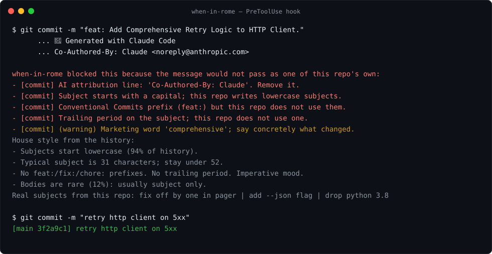

<p align="center">
  
</p>

<h1 align="center">when-in-rome</h1>
<p align="center"><strong>When in Rome, commit as the Romans do.</strong></p>
<p align="center">
  <a href="https://github.com/aliradid/when-in-rome/actions/workflows/ci.yml"></a>
  <a href="https://github.com/aliradid/when-in-rome/actions/workflows/plugin-load-check.yml"></a>
  <a href="LICENSE"></a>
  
</p>

Your git history knows which commits the AI wrote. `feat:` prefix, capital letter,
a bullet-list body, a `Co-Authored-By: Claude` trailer, sitting between `fix typo` and
`bump deps`. when-in-rome reads the repo's own history, makes the agent write like the
humans who work there, and blocks the commits and PRs that would stand out.

```bash
claude plugin marketplace add aliradid/when-in-rome
claude plugin install when-in-rome@when-in-rome
```

Also a git hook, a pre-commit hook, and a GitHub Action. Codex, Cursor, Gemini CLI,
OpenCode and the rest: [INSTALL.md](INSTALL.md).

## Audit your repo first

```bash
git clone https://github.com/aliradid/when-in-rome ~/.when-in-rome
python3 ~/.when-in-rome/scripts/audit_history.py --repo .
```

```
when-in-rome audit of .
  commits scanned      500  (+12 bot commits skipped)
  look machine-written 353  (278 with hard tells)
  native score         29/100
  tells:
    attribution        278
    style outlier      243
    narration          1
  worst offenders (first 8):
    14f065e  Add highlighted captions and tighter visual pacing to brande  [style outlier]
    1faec0f  EN TTS respell: Ducati -> Ducahti (first English entry) + En  [attribution, style outlier]
    ...
```

That is one of the author's own repos, before this tool existed. Post yours.

## How it works

**1. It reads the room.** `style_profile.py` looks at the last 300 human commits, skipping
bots and anything with an AI trailer, and reports what the history is consistent about:

```
House style from 214 human commits (confidence: high):
- Subjects start lowercase (94% of history).
- Typical subject is 31 characters; stay under 52.
- No trailing period on the subject.
- No feat:/fix:/chore: prefixes; this repo does not use Conventional Commits.
- Imperative mood ('add', 'fix', 'remove'), not 'added' or 'adding'.
- Common first words: fix, add, remove, use, bump.
- Bodies are rare (12%): usually subject only; add a body only when the why is not obvious.
- Branch names use a prefix: feature/, fix/.
Representative subjects:
  fix off by one in pager
  add --json flag
  drop python 3.8
```

Only things the history is at least 80% consistent about become rules. A repo that
uses Conventional Commits gets Conventional Commits. A repo that writes
`Fix token expiry.` gets a capital and a period. A repo full of `bump deps` gets
`bump deps`.

**2. The agent writes in it.** The skill says: profile first, then write the subject in
the repo's voice with the first words the history uses; body only when the repo does;
one logical change per commit; branch names shaped like `git branch -a`; PR bodies
shaped like the repo's merged PRs. Never narration, never attribution, never a stock
template. The house style is also injected at session start, so the agent knows it
before it touches anything.

**3. What doesn't pass gets blocked.** A Claude Code PreToolUse hook checks every
`git commit` and `gh pr create` before it runs. Fail, and the agent gets the reasons and
the house style back and has to rewrite (that's the picture at the top). With
`WHEN_IN_ROME_AUTOFIX=1`, mechanical problems (attribution lines, case, period, prefix)
are fixed in place and only real problems bounce.

Same check, four more places:

| Where | How |
| --- | --- |
| Any repo, any agent, any human | `python3 scripts/install_git_hook.py --repo .` installs a `commit-msg` hook |
| pre-commit | `- repo: https://github.com/aliradid/when-in-rome` with `hooks: [{id: when-in-rome}]` |
| Pull requests | `uses: aliradid/when-in-rome@v1` fails PRs with AI tells in commits or description |
| CI, any range | `python3 scripts/check_range.py --base origin/main --head HEAD --github` |

## What counts as a tell

**Hard, anywhere:** AI attribution lines (`Co-Authored-By: Claude`, `Generated with`,
the robot emoji), narration ("This commit ...", "In this PR ..."), conversation leaks
("per your instructions", "the user asked for"), the stock `## Summary / ## Test plan`
skeleton. Git's own messages (merges, reverts, fixups) are exempt from everything but
the attribution check.

**Style, only where the history is consistent the other way:** first-letter case,
subject length past the repo's 90th percentile, type prefixes present or missing,
trailing period, past tense, emoji.

**Warnings, never blocking:** marketing words (comprehensive, robust, seamless,
leverage, enhance, streamline), "This change ..." bodies, "as requested" without a
reference, tool names, checkbox test plans, a long body in a repo that never writes
them.

Details and before/after examples: [tells.md](skills/when-in-rome/references/tells.md),
[examples.md](skills/when-in-rome/references/examples.md).

## Proof

Live run, Claude Code with the plugin loaded. Three throwaway repos with different
histories, the same staged change (a retry loop in an HTTP client), one instruction:
"commit the staged change". No hints about style.

| Repo history looks like | What the agent committed |
| --- | --- |
| `fix typo in readme`, `bump deps`, `drop python 3.8` | `retry failed requests` |
| `feat(api): add pagination`, `fix(auth): expire tokens` | `feat(client): retry with backoff` |
| `Add pagination to the API.`, `Fix token expiry.` | `Retry failed requests.` |

The GitHub Action, on this repo's own [pull request #1](https://github.com/aliradid/when-in-rome/pull/1):
a deliberately bad commit (`feat:` prefix, capital, period, narration, Claude trailer)
failed the check; the plain PR title and body passed.

Deterministic corpus: 30/30. Unit tests: 65. This repo's CI runs the checker over its
own history on every push, so it can never drift.

## Why not just a template?

Every commit-message tool on GitHub generates Conventional Commits. That is a template,
and a template is exactly what gives machine-written history away. Humans don't write
to a template; they write like the people around them. The right format for a repo is
whatever its `git log` already says it is.

## Is this about hiding AI use?

No. It stops agents from defacing a history with messages that carry no information,
and makes them write the message a maintainer would have written: what changed, why,
in the repo's own words. Whether you disclose AI assistance is your policy. Put it in
the PR description or `CONTRIBUTING.md`, where it belongs, not in every commit subject.

## Dials

| | |
| --- | --- |
| `/when-in-rome` | invoke the skill explicitly |
| `stop when-in-rome` | off for the session |
| `WHEN_IN_ROME_OFF=1` | disables the hooks for a shell |
| `WHEN_IN_ROME_AUTOFIX=1` | fix mechanical tells in place instead of bouncing |
| `CONTRIBUTING.md` or `commit.template` states a format | that wins over observed history |
| the user names a format | the user wins |

## Layout

```
skills/when-in-rome/SKILL.md      the skill (source of truth)
skills/when-in-rome/references/   tells, before/after examples
scripts/style_profile.py          house-style profiler
scripts/check_message.py          checker (commit and PR modes, --fix)
scripts/audit_history.py          scan a repo, get a native score
scripts/check_range.py            CI: check a commit range and PR text
scripts/install_git_hook.py       git commit-msg hook installer
hooks/                            Claude Code PreToolUse + SessionStart hooks
action.yml                        GitHub Action
.pre-commit-hooks.yaml            pre-commit hook
evals/                            histories, message corpus, live runner
```

No dependencies beyond Python 3 and git.

## Contributing

The most useful issue is "it let this through" or "it blocked this native message".
Paste the message and ten subjects from the repo's history. See
[CONTRIBUTING.md](CONTRIBUTING.md).

## License

MIT.
